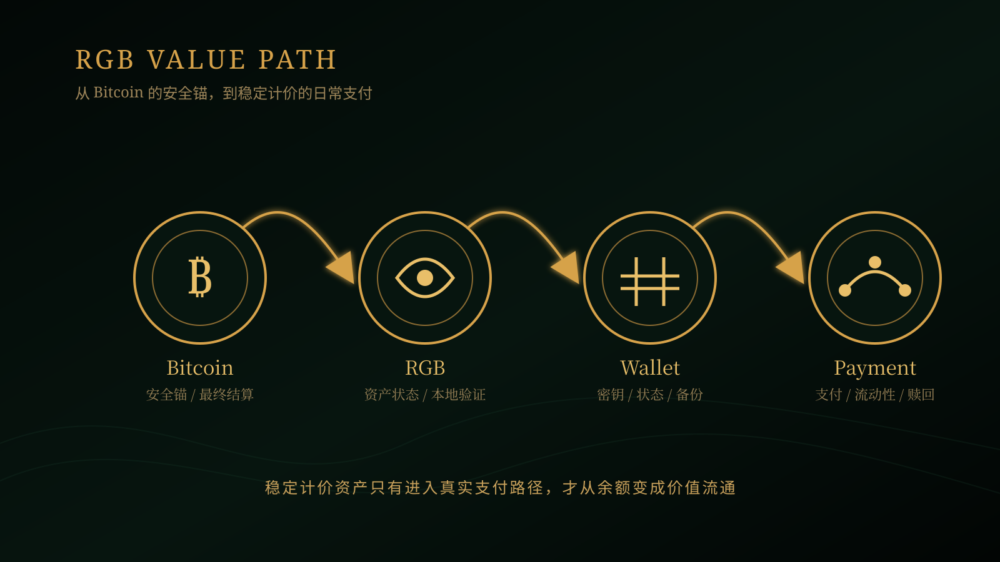
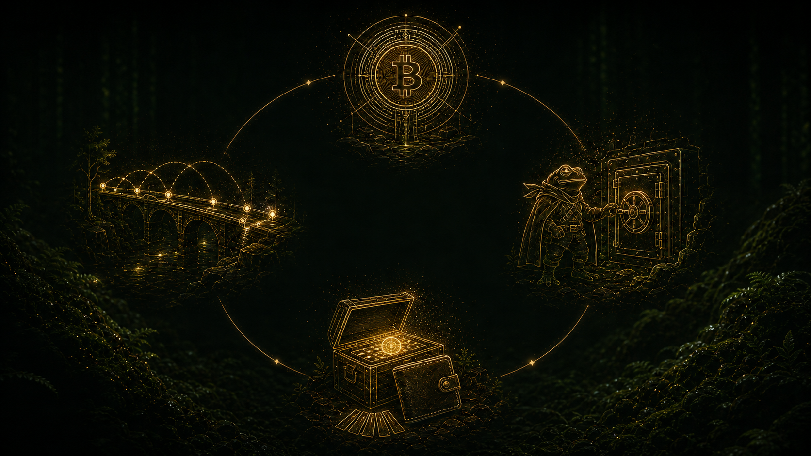

# 《RGB Value Analysis》第 01 篇｜为什么 USDT 要回到 Bitcoin？

> **副标题**：稳定计价资产，为什么需要 Bitcoin 原生路径？

> **第 1/20 篇**  
> **状态标签**：协议事实｜产品资料｜推断｜待验证  
> **标签说明**：协议事实来自规范；产品资料来自官方文档；推断是基于事实的判断；待验证表示尚未形成充分产品或市场证据。  
> **最后核验**：2026-08-05  
> **本篇问题**：如果 Bitcoin 已经能保存价值，为什么还需要稳定计价资产？为什么这件事与 RGB 有关？

*主视觉说明：Bitcoin 的安全锚、稳定计价资产与真实支付路径开始连接。*

## 开场：一个普通用户的支付问题

想象一位跨境自由职业者：他愿意长期持有 BTC，也希望不把资产交给中心化平台，但客户需要用美元计价，商户也不想承担付款到账前的价格波动。他当然可以直接收 BTC，却要不断重新计算报价；也可以使用托管平台里的稳定币，却要接受账户冻结、提现限制和平台信用。这个场景真正提出的问题是：**能不能保留 Bitcoin 的安全与自托管，同时拥有一种更适合日常计价和支付的资产？**

## 先说结论

USDT 想进入 Bitcoin，不是因为 Bitcoin 缺少一个“更大的代币”，而是因为价值储存网络还需要一种更适合日常计价、支付和跨境结算的资产。RGB 提供了一条把资产状态锚定在 Bitcoin、同时不把全部资产数据复制给全网的路径；Lightning 则可能为这些资产提供更快的流转路径。

但要先把事实边界说清楚：Tether 在 2025 年 8 月宣布“计划”在 RGB 上推出 USD₮，这说明发行方看到了 Bitcoin 原生稳定资产的战略价值；它不等于所有用户今天已经可以在主网上无摩擦地持有、支付和赎回 USD₮。Tether 的 WDK 文档目前把 `@utexo/wdk-wallet-rgb` 列为社区模块，并明确提醒该模块由第三方独立维护。**因此，本篇解释的是为什么这条路径值得存在，而不是宣布产品已经完成。**

## 一、Bitcoin 解决了价值保存，却没有解决所有计价问题

Bitcoin 最重要的能力，是让用户在没有中心账本管理员的情况下持有和转移稀缺数字价值。对长期储存而言，价格波动未必是缺点；但对一杯咖啡、一笔工资或一项跨境服务来说，付款人和收款人往往先想知道“这是多少美元”，而不是“这是多少聪、明天可能值多少美元”。

稳定计价资产的作用，就是把价格表达变得简单。它不一定比 BTC 更重要，却可能更适合支付场景：商户能标价，用户能预算，结算双方能减少短期波动带来的争议。问题随之变成：稳定资产应当运行在什么样的基础设施上？如果它完全依赖中心化平台，用户得到便利，却可能失去资产控制权；如果把每个交易细节都公开上链，隐私、区块空间和全网验证成本又会增加。

RGB 的切入点，正是这组矛盾。

*问题图说明：Bitcoin 擅长保存价值，但日常支付还需要更稳定的计价方式。*

## 二、“回到 Bitcoin”不是回到旧的 Omni 路径

这里的“回到 Bitcoin”不能简单理解为恢复过去的 USD₮-Omni。Tether 在 2023 年曾宣布停止铸造 Omni、Kusama 和 BCH SLP 版本的 USD₮，并说明会根据使用率、社区需求、安全性、客户支持与合规成本评估传输层。今天讨论 RGB，是在讨论一种新的 Bitcoin 原生资产路径，而不是把旧方案原样搬回来。

差别在于：RGB 不要求把资产的全部业务状态公开写进 Bitcoin 区块链。资产的详细状态和验证资料由相关参与者保存、验证，Bitcoin 交易则承担锚定和最终结算的角色。这样做有机会同时保留 Bitcoin 的安全属性、稳定资产的计价能力与更小的资产数据占用；挑战在于钱包、资料备份、接收验证、跨产品互操作和流动性都必须真正可用。

所以，“USDT 为什么要回到 Bitcoin”的完整答案不是“因为 Bitcoin 最安全”这一句口号，而是：**如果用户既想要稳定计价，又不想把全部资产控制权交给单一平台，那么 Bitcoin 需要一种能承载稳定资产、而且不必把所有细节变成全网公共状态的方式。**

*流程图说明：Bitcoin 提供安全锚，RGB 表达资产状态，Wallet 管理密钥与资料，Payment 才把资产带入真实流通。*

## 三、USDT 回到 Bitcoin 后，用户获得了什么？

这里的价值不是 RGB 单独创造的，而是由三层能力共同形成：Bitcoin 提供安全锚，RGB 表达资产状态，Lightning 与相关服务提供流动和支付路径。对普通用户来说，真正重要的不是协议名称，而是这条路径能否让资产更安全地持有、更容易流转，并最终完成真实任务。

### 1. 技术价值：把资产规则与 Bitcoin 结算连接起来

RGB 使用客户端验证和一次性封印，将资产权利与 Bitcoin 交易图中的可花费输出关联。接收方需要验证与自己有关的资产历史，而不是只相信一个网页上的余额数字。对于稳定资产，这意味着发行规则、供应上限、转移记录等可以有一套可验证的协议表达；Bitcoin 则提供时间顺序与结算锚点。

这不是“资产数据消失了”，而是验证责任被重新分配。相关资料必须可靠送达、保存和恢复；任何钱包都不能只保存种子词而忽略 RGB 状态资料。技术价值因此同时包含收益与代价：它有减少全网复制和公开暴露的潜力，但也提高了本地状态管理的要求。

### 2. 生态价值：让 Bitcoin 钱包不只管理 BTC

如果稳定资产能使用 RGB 标准被发行和验证，钱包就有机会在同一个自托管界面里管理 BTC 与 RGB 资产。开发者可以围绕资产发行、收款、转账、支付和兑换构建产品；商户不必为了接受稳定计价资产而完全迁移到另一套生态。

但“有一个 RGB 钱包模块”不等于生态闭环。Tether WDK 文档目前明确把 UTEXO 的 RGB 模块列为社区模块，并提醒 Tether 与 WDK 团队不对其代码、安全性或维护承担责任。这反而提醒我们：基础设施接入是起点，生产级审计、备份、互操作、客服和资产发行责任仍需逐层确认。

### 3. 流动性价值：稳定计价资产要能被支付和兑换

一枚稳定资产只有在“需要时能用”才有流动性价值。用户需要把它发给别人、在商户处支付，或者换回 BTC、法币和其他资产。Lightning 的设计目标是通过支付通道提供快速、低成本的链下支付；如果 RGB 资产能够与相应的通道和流动性服务协作，它就可能从“钱包中的余额”变成“支付路径中的资产”。

这里有一个不能跳过的条件：通道里必须有正确方向、正确金额和足够深度的流动性。协议支持不等于每笔支付都会成功，DEX 上出现交易对也不等于拥有稳定的市场深度。发行方、做市商、RGB-LSP、钱包和商户需要共同提供这条路。

### 4. 应用价值：从稳定支付到更广的 Bitcoin 应用层

第一批合理的应用可能不是复杂金融产品，而是稳定计价支付、跨境结算、商户收款、数字服务付款和小额机器支付。之后，若发行规则、法律权利、赎回与审计能够闭环，RWA 可能使用相同的资产状态基础；若钱包和支付接口足够简单，AI Agent 或游戏应用也可能调用稳定资产完成机器间或游戏内外的价值交换。

这里必须坚持顺序：先有可验证的资产，再有可恢复的钱包；先有可获得的流动性，再有真实支付；先有清楚的发行与赎回责任，再谈金融应用。应用是基础设施成熟后的结果，不是文章开头可以直接许诺的卖点。

## 四、这条路最大的风险是什么？

第一，**发行风险**：RGB 可以验证资产状态是否按规则转移，不能替发行方保证储备、赎回和法律责任。第二，**数据可用性风险**：用户丢失必要的 RGB 状态资料，可能影响资产恢复，即使种子推导出的 BTC 地址仍然存在。第三，**流动性风险**：没有足够的通道、报价和兑换深度，稳定资产仍然只能被持有，不能顺畅流通。第四，**产品风险**：当前可见的 RGB 钱包接入可能包含社区维护模块，用户不能把“官方生态出现链接”误认为“所有资金场景已经生产级验证”。

因此，普通用户真正要问的不是“USDT 上 RGB 会不会涨”，而是：我使用的资产由谁发行？我的钱包保存了什么？换设备能否恢复？有哪些真实支付和兑换路径？出现服务中断或发行方问题时，我如何退出？

*边界图说明：协议验证、发行方信用、钱包状态管理和支付流动性是四种不同责任，不能互相替代。*

## 五、未来还能演化成什么？

如果 Tether 的发行计划最终落地，并且钱包、Lightning 通道、流动性服务和交易产品都能稳定协作，RGB 可能成为 Bitcoin 上承载稳定计价资产的一条原生路径。那时，Bitcoin 的角色就不只是“保管 BTC 的保险库”，也可能成为稳定资产发行、支付和结算的安全底座。

但这仍是一组有条件的未来：需要发行真正落地，需要跨钱包互操作，需要持续可得的流动性，需要用户能安全备份与恢复，也需要发行和赎回责任被清楚披露。今天最稳妥的判断是：**这条路径值得研究，但只有当发行、钱包、流动性和支付都被真实验证，它才会成为 Bitcoin 价值流通网络的一部分。**

## 下一篇预告

**第 02 篇｜为什么 Bitcoin 不需要重新造一条链？**  
下一篇我们会回答：如果 RGB 要承载资产，为什么不直接创建一条专用链？不造新链，究竟换来了什么，又把哪些责任留给了钱包和应用？

## 给读者的问题

如果你可以在一个自托管钱包里同时持有 BTC 和 RGB 版稳定资产，你最想先用它完成哪件事：跨境收款、商户支付、朋友转账，还是其他场景？

## 参考资料

- [Tether：Tether to Launch USD₮ on RGB](https://tether.io/news/tether-to-launch-usdt-on-rgb-expanding-native-bitcoin-stablecoin-support/)
- [Tether：关于停止部分旧传输层 USD₮ 铸造的说明](https://tether.io/news/tether-makes-strategic-transition-to-meet-community-demands-and-foster-innovation/)
- [RGB Protocol Documentation：Client-side Validation](https://docs.rgb.info/distributed-computing-concepts/client-side-validation)
- [RGB Protocol Documentation：Supported Schemas](https://docs.rgb.info/rgb-contract-implementation/schema/supported-schemas)
- [WDK：RGB wallet module](https://docs.wdk.tether.io/sdk/community-modules/wdk-wallet-rgb/)
- [Lightning Network：技术与支付说明](https://lightning.network/docs/)
