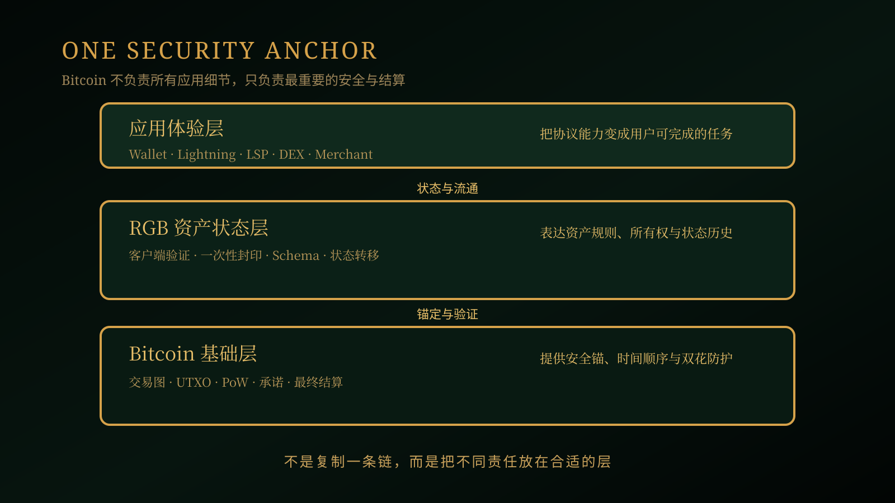

# 《RGB Value Analysis》第 02 篇｜为什么 Bitcoin 不需要重新造一条链？

> **副标题**：RGB 如何借用 Bitcoin 的安全，而不是复制 Bitcoin？
> 
> **第 2/20 篇**  
> **状态标签**：协议事实｜产品资料｜推断｜待验证  
> **标签说明**：协议事实来自规范；产品资料来自官方文档；推断是基于事实的判断；待验证表示尚未形成充分产品或市场证据。  
> **最后核验**：2026-08-05  
> **本篇问题**：为了让 Bitcoin 承载更多资产和应用，真的必须重新创建一条链吗？

*主视觉说明：Bitcoin 是安全锚，RGB 和应用在其上延展，而不是另起一套结算网络。*

## 开场：为什么每个应用都想拥有自己的链？

假设一个团队想发行稳定资产、数字凭证或游戏道具。最直观的方案，是创建一条新链：自己决定区块大小、交易速度、费用和智能合约规则。听起来很自由，但普通用户真正要问的是：这条链由谁维护？它的安全从哪里来？钱包是否支持？如果验证者停止运行，我的资产还能不能退出？

所以本篇的问题不是“新链好不好”，而是：**为了让 Bitcoin 承载更多资产，我们是否真的需要复制一套新的共识网络？**

## 先说结论

Bitcoin 不需要为每一种资产和应用重新造一条链。更合理的分工是：让 Bitcoin 继续承担安全锚和最终结算，让 RGB 在其上表达资产状态，把不必全网复制的数据交给相关参与者验证和保存，再由钱包、Lightning、LSP 和应用把这些能力变成用户体验。

这不是说新链没有价值，也不是说 RGB 没有自己的工程挑战。它只是提出了另一种选择：**不要为了获得资产功能，自动新增一套共识、验证者和信任假设。**

## 一、重新造一条链，究竟多了什么？

一条专用链可以拥有独立的区块空间，也可以按照某个应用的需求设置交易规则、发行机制和执行环境。对于需要全局共享状态、频繁更新或特殊虚拟机的应用，这些能力可能很有用。

但新链同时带来一整套必须重新建立的基础设施：节点、验证者、共识规则、经济激励、钱包、区块浏览器、交易市场和安全预算。用户不只是在使用一个新应用，也是在信任一套新的网络。即使它技术上运行正常，也要面对验证者集中、流动性不足、升级争议和长期维护的问题。

更重要的是，链越多，资产和用户越容易被分散。一个稳定资产如果在不同网络上分别发行，钱包、交易所、商户和支付服务就需要分别适配；用户每跨一次网络，还可能引入桥、包装资产或托管中介。新链解决了某些性能和功能问题，却不一定减少整个生态的复杂性。

*问题图说明：新链可以提供独立能力，但也要重新建立验证者、钱包、流动性和安全预算。*

## 二、Bitcoin 应该负责什么？

Bitcoin 的价值，不在于它必须知道每个应用的全部业务细节，而在于它提供了一套公开、难以篡改、可独立验证的交易历史和最终结算机制。它擅长回答的是：某笔交易是否发生、某个 UTXO 是否已经被花费、某项控制权是否按既定的花费条件转移；资产规则本身的验证，则属于 RGB 的客户端验证。

这意味着，我们可以把系统拆成三层：

1. **基础层共识**：由 Bitcoin 处理交易排序、双花防护和最终结算。
2. **资产状态**：由 RGB 表达资产的发行规则、所有权和状态转移。
3. **应用体验**：由钱包、Lightning、LSP、DEX、商户和其他产品完成。

下面三节分别解释这三层如何分工：Bitcoin 提供安全锚，RGB 负责资产状态的客户端验证，钱包与 Lightning 把协议能力变成可使用的流通路径。

关键问题是：哪些信息必须让全网知道，哪些信息只与资产持有人和交易对手有关？如果每个应用的所有状态都公开写进基础层，隐私、区块空间和全网验证成本会一起上升。反过来，如果完全离开 Bitcoin，又会引入一套新的安全和结算假设。

*分层图说明：Bitcoin 负责安全与结算，RGB 负责资产状态，钱包、Lightning 与应用负责把能力变成用户任务。*

## 三、RGB 如何借用 Bitcoin，而不是复制 Bitcoin？

### 1. Bitcoin 作为安全锚

RGB 将资产权利与 Bitcoin 交易图中的可花费输出关联。Bitcoin 交易可以承载承诺、时间顺序和最终结算；RGB 不需要修改 Bitcoin 的货币共识，也不要求 Bitcoin 节点理解每一种资产的全部业务规则。

这让 Bitcoin 保持它最重要的角色：安全锚。RGB 不是另起一条链来重新定义谁可以改变历史，而是在 Bitcoin 已有的交易和所有权控制之上表达新的数字权利。

### 2. 客户端验证：不是不验证，而是换人验证

RGB 的客户端验证模型，把与某项资产有关的状态历史交给相关参与者在本地验证。发送方把接收方需要的资料传递过去，接收方检查从合约初始状态到当前转移是否遵守规则；Bitcoin 上只需要留下用于锚定的承诺。

这样做有两个潜在好处：无关节点不必保存所有资产的完整资料，资产细节也不必公开给全网。代价则是资料可用性变得重要：钱包需要保存、备份和恢复 RGB 状态，接收方需要拿到足够的验证资料，应用之间也要遵守兼容的传递方式。

### 3. 一次性封印：把权利转移接回 UTXO

RGB 使用一次性封印来关联资产状态和 Bitcoin 输出。一个输出被花费时，旧封印被关闭，相应的状态转移可以被验证；这为资产权利提供了与 Bitcoin 交易图一致的唯一性约束。

普通用户不需要先掌握密码学细节，只要记住一点：RGB 不是在另一个公开余额表里凭空记录资产，而是把资产权利的转移和 Bitcoin 可花费的控制权联系起来。

### 4. Lightning 提供流通空间

如果只依赖 RGB 的链上转移，它仍然更接近资产登记和结算工具，而不是日常支付网络。Lightning 通过支付通道承载链下更新，为低延迟、小额和高频流转提供了可能。RGB 的资产状态可以尝试与 Bitcoin/Lightning 生态协作，而不必为了每次支付创建一条新链。

但这只是架构空间，不是自动完成的产品能力。通道容量、流动性方向、钱包支持、LSP 服务和失败处理，都必须在应用层真正解决。

## 四、不造新链，为用户带来什么价值？

### 技术价值

用户不必为了使用一种 Bitcoin 原生资产，先迁移到一套完全独立的安全网络。资产状态可以利用 Bitcoin 的结算锚，同时把不需要公开的数据留在相关参与者之间。技术收益是减少重复共识和全网状态复制的可能性；挑战是本地资料管理和验证体验必须足够可靠。

### 生态价值

钱包、节点、Lightning 和 Bitcoin 的开发经验可以继续复用。发行方、开发者、商户和交易产品不必为每种资产从零搭建一条完整网络。生态的入口可能更多，但安全锚和部分基础设施保持一致。

### 流动性价值

如果资产能够接入 Bitcoin 的支付和结算路径，它就有机会与 BTC、稳定计价资产和其他 RGB 资产交换。需要强调的是，共享 Bitcoin 生态不等于自动拥有流动性；RGB-LSP、DEX、LP、钱包和发行方仍然要提供真实可用的通道、报价和兑换。

### 应用价值

稳定支付、跨境结算、数字凭证、RWA 和游戏资产，都可以围绕同一个安全锚逐步构建。用户不必先理解一条新链的全部规则，应用也不必把每项资产都锁在孤立的网络里。

## 五、不造新链的代价与边界

不造新链不是没有代价，而是把代价放在了不同位置。

第一，RGB 不会凭空获得一条独立链的全局吞吐量；它的扩展性来自客户端验证和状态分工，不代表所有场景都适合。第二，用户和钱包需要承担更多资料备份与恢复责任。第三，索引器、传输服务、LSP 和应用需要额外适配，互操作不会自动出现。第四，复杂的共享状态和高频协作场景，必须检验具体 RGB 合约设计是否适合。第五，协议能够运行，不等于跨钱包、跨服务和跨资产已经成熟。

这也决定了 RGB 的价值不需要依赖发行一枚新链代币来体现。它更可能通过 Bitcoin 结算需求、资产发行、钱包、LSP、DEX 和应用使用逐步沉淀——这是基于架构的推断，取决于后续真实采用；具体的价值捕获机制，留到后面的 BTCFi 篇再展开。

*边界图说明：Bitcoin 提供安全锚，RGB 处理资产状态，钱包与服务负责把能力交付给用户。*

## 六、未来还能演化成什么？

如果这套分工能够被产品验证，Bitcoin 可以继续作为安全与结算层，RGB 承载更多可验证资产和数字权利，Lightning、钱包、LSP 与交易产品则把资产带入流通。未来可能出现的，不是一条包办所有功能的新链，而是“一个安全锚、多个资产类型、多个应用入口”的 Bitcoin 原生网络。

这个未来仍然有条件：状态资料要能可靠交付，钱包要能安全恢复，服务之间要能互操作，流动性要持续可得，用户还要能在出现故障时退出。**不重新造一条链的价值，不是少写一套代码，而是尽量少新增一套用户必须信任的安全与结算系统。**

## 下一篇预告

**第 03 篇｜为什么 Bitcoin 的“余额”不是账户余额？**  
下一篇我们会从 UTXO 开始，解释 RGB 为什么把资产权利和 Bitcoin 的可花费输出联系在一起，以及这对钱包体验意味着什么。

## 给读者的问题

如果你不需要迁移到一条新链，就能使用 Bitcoin 原生稳定资产，你最担心的会是什么：钱包恢复、流动性、发行方信用，还是其他问题？

## 参考资料

- [RGB Blueprint：Private & scalable smart contracts for Bitcoin & Lightning](https://rgb-org.github.io/)
- [RGB Protocol Documentation](https://docs.rgb.info/)
- [RGB Protocol Documentation：Client-side Validation](https://docs.rgb.info/distributed-computing-concepts/client-side-validation)
- [RGB Protocol Documentation：Bitcoin Single-use Seals](https://docs.rgb.info/annexes/single-use-seals-bitcoin)
- [RGB Protocol Documentation：Contract Transfers](https://docs.rgb.info/annexes/contract-transfers)
- [Bitcoin 白皮书](https://bitcoin.org/bitcoin.pdf)
- [Bitcoin Developer Guide](https://developer.bitcoin.org/devguide/)
- [Lightning Network：技术与支付说明](https://lightning.network/docs/)
