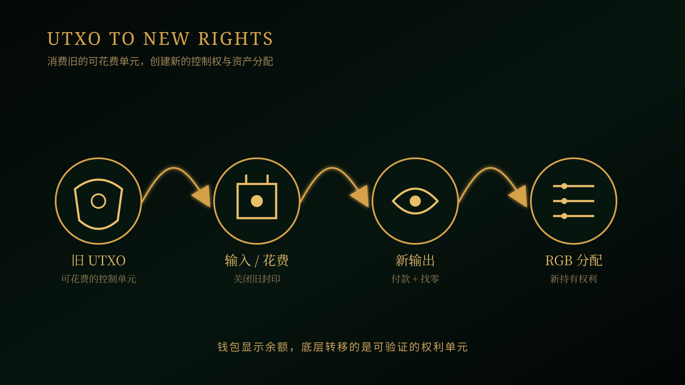

# 《RGB Value Analysis》第 03 篇｜为什么 Bitcoin 的“余额”不是账户余额？

> **副标题**：从 UTXO 到 RGB，理解资产如何跟着可花费权利转移
> 
> **第 3/20 篇**  
> **状态标签**：协议事实｜产品资料｜推断｜待验证  
> **标签说明**：协议事实来自规范；产品资料来自官方文档；推断是基于事实的判断；待验证表示尚未形成充分产品或市场证据。  
> **最后核验**：2026-08-05  
> **本篇问题**：如果 Bitcoin 没有一个全局账户余额，钱包里的“余额”到底是什么？

*主视觉说明：钱包把多个可花费权利单元汇总成用户看到的余额。*

## 开场：为什么钱包里的余额会“拆开”？

假设你的钱包里有 0.1 BTC。你支付 0.03 BTC 后，钱包不会像银行账户一样简单地把数字减掉；它可能要选择一组可花费的输出，创建付款输出，再创建一笔找零。对用户来说，界面最后仍然只显示“还剩多少”，但底层其实发生了多次权利转移。等你开始使用 RGB 稳定资产时，同样的 UTXO 结构还会与另一套资产状态和验证资料协作。

这就带来一个很基础、却非常重要的问题：**Bitcoin 的余额不是账户里的一个数字，那它究竟是什么？**

## 先说结论

Bitcoin 的余额不是链上某个账户字段，而是一组尚未花费的交易输出。钱包把这些可花费的权利单元加总，才显示出用户熟悉的余额。RGB 进一步把资产状态与这些可花费权利关联，所以资产转移不是修改某个账户余额，而是消费旧的权利单元，并创建新的权利单元。

这也是理解 RGB 钱包的起点：钱包显示的是汇总结果，真正决定“能不能花”的，是底层哪些输出和资产分配仍然有效、可验证、可被当前密钥控制。

## 一、账户余额只是用户界面

我们熟悉的银行账户模型是：一个账户对应一个持续变化的余额。收到 100 元，余额加 100；支付 30 元，余额减 30。这个模型非常适合人类阅读，也让应用开发者容易理解。

Bitcoin 的底层不是这样工作的。钱包页面显示的 BTC 余额，通常是多个地址、多个交易输出的汇总。同一个钱包可以拥有很多地址，一个地址也可能关联多个 UTXO；“余额”是软件计算出来的结果，而不是区块链里存在一个叫作 `balance` 的字段。

可以把它想象成钱包里装着多张不同面额的纸币。你看到的是“纸币总价值”，支付时却必须挑出具体几张交给对方；如果面额不刚好，还要收到一张找零纸币。Bitcoin 的交易输出，就像这些可以被单独交付的权利单元。

*问题图说明：账户模型强调一个持续变化的数字，UTXO 模型则由多个可以分别花费的输出组成。*

## 二、UTXO 到底是什么？

UTXO 是 Unspent Transaction Output 的缩写，意思是“尚未花费的交易输出”。一笔 Bitcoin 交易会消费一个或多个旧输出，并创建一个或多个新输出。

- **输入**代表：我要花掉哪些旧的权利单元。
- **输出**代表：新的控制权交给谁，以及在什么花费条件下可以被使用。
- **找零**代表：原来的输出金额没有全部支付出去，剩余部分被创建成新的输出，回到付款方控制的地址或脚本条件下。

因此，Bitcoin 交易不是把一个账户里的数字改小，而是把旧的可花费单元关闭，再创建新的可花费单元。基础层主要验证签名、脚本条件和 UTXO 是否已经被花费；它不需要理解每个应用的业务规则。

这里要先划一条边界：UTXO 是 Bitcoin 控制 BTC 的底层单元，**不等于 RGB 资产本身**。RGB 资产还需要自己的状态、规则和客户端验证；Bitcoin 的 UTXO 为它提供控制权和锚定位置，但不会自动替 RGB 检查所有资产规则。

*流程图说明：交易消费旧的可花费单元，创建付款输出与找零，RGB 再为新的控制权关联资产分配。*

## 三、RGB 为什么要把资产跟 UTXO 绑定？

### 1. 所有权需要一个可以被花费的锚

如果一种资产只存在于某个公开账户表里，用户需要相信那个账户表一直正确更新。RGB 选择把资产权利与 Bitcoin 交易图中的特定输出关联，让“谁能花费这个输出”成为资产控制权的重要基础。

这并不表示资产的全部资料都写进 Bitcoin。Bitcoin 提供可被验证的交易和花费条件，RGB 资料则说明这项资产从发行到当前状态经历了什么，以及这次转移是否遵守合约规则。

### 2. 一次性封印如何关闭旧权利

RGB 使用一次性封印来关联资产状态和 Bitcoin 输出。当旧输出被花费时，关联的旧封印被关闭，相应的资产状态转移可以被验证；新的输出则承载新的资产分配和新的控制权。

普通用户不需要先掌握密码学细节，只要理解这个比喻：一张带有资产权利的票据只能被交付一次，旧票据交出去后失效，新票据才代表下一位持有者的权利。Bitcoin 的交易图提供了这条转移路径，RGB 的客户端资料负责验证资产规则。

### 3. 资产状态不是写在 BTC 余额里

钱包需要同时处理两类信息：一类是 Bitcoin 的 UTXO 和花费条件，另一类是 RGB 的资产历史、分配和状态规则。只看 BTC 地址余额，无法判断一个 RGB 资产是否有效；只保存 RGB 资产名称，也无法证明当前用户控制着相应的 Bitcoin 输出。

这也是为什么 RGB 钱包比普通 BTC 钱包更复杂：它必须把两套相关、但不相同的状态管理好。

## 四、这对用户和钱包带来什么价值？

### 技术价值

资产所有权转移可以与 Bitcoin 的花费条件和双花防护连接。RGB 不需要依赖一个全网公开的账户余额表来表达所有资产状态，相关参与者可以验证与自己有关的历史。

### 生态价值

钱包、节点、发行方和支付服务可以围绕共同的 UTXO 语义协作：发行时创建初始分配，转移时消费旧分配，收款时验证新分配，找零时保持剩余权利可用。

### 流动性价值

钱包知道哪些资产单元可以支付、哪些需要合并、哪些可能受通道或状态限制。UTXO 的选择会影响交易费用、找零和支付是否成功。拥有余额不等于拥有一条可用的支付路径，还要结合 Lightning 通道和实际流动性。

### 应用价值

稳定币支付、商户收款、数字凭证和游戏资产，都需要清楚的所有权转移。用户不必理解每个 UTXO，但钱包必须替用户正确地选择、验证和恢复这些权利单元。

## 五、普通用户最容易误解的四件事

第一，**钱包显示余额，不代表链上有一个账户余额。** 它是多个 UTXO 或资产分配的汇总。

第二，**BTC 的 UTXO 不等于 RGB 资产。** UTXO 提供 Bitcoin 控制权和锚定位置，RGB 仍需要独立的状态与规则验证。

第三，**同一个地址不等于所有资产都在同一个账户里。** 不同资产、不同输出和不同状态可能分别管理。

第四，**种子词不一定包含全部 RGB 状态资料。** 钱包还要备份客户端验证所需的数据；丢失这些资料，可能影响资产恢复和验证。

*边界图说明：Bitcoin 提供可花费的控制单元，RGB 提供资产状态验证，钱包负责把密钥与资料安全交付给用户。*

## 六、未来：让用户无感使用 UTXO

未来钱包的竞争，不是谁能让用户看到更多 UTXO，而是谁能把 UTXO 的复杂性安全地隐藏起来。

> **好钱包不是教用户理解 UTXO，而是让用户在不理解 UTXO 的情况下，也能安全地使用资产。**

这里的“无感”不是完全隐藏，而是三层体验：日常使用时，用户只看到余额、支付、收款和找零；遇到问题时，钱包能够解释为什么某笔资产不能支付、为什么产生手续费、为什么需要等待状态资料；在高级模式下，用户仍可以查看 UTXO、管理备份、迁移状态并恢复资产。

自动找零、智能选择可支付单元、状态备份与迁移，都会成为 RGB 钱包的基础体验。未来的好钱包，应当让用户不必面对底层复杂性，同时保留可验证性、自托管和退出能力。

## 下一篇预告

**第 04 篇｜如果没有 RGB，Bitcoin 资产会缺少什么？**  
下一篇我们会把 RGB 放回问题空间：如果没有这套客户端验证的资产路径，Bitcoin 上的资产需求会由哪些方案承担，又会付出什么代价？

## 给读者的问题

你第一次知道 Bitcoin 没有“账户余额”时，最困惑的是找零、地址，还是资产所有权？

## 参考资料

- [Bitcoin Developer Guide：Transactions](https://developer.bitcoin.org/devguide/transactions.html)
- [Bitcoin Developer Guide](https://developer.bitcoin.org/devguide/)
- [RGB Protocol Documentation：Bitcoin Single-use Seals](https://docs.rgb.info/annexes/single-use-seals-bitcoin)
- [RGB Protocol Documentation：Contract Transfers](https://docs.rgb.info/annexes/contract-transfers)
- [RGB Protocol Documentation：Client-side Validation](https://docs.rgb.info/distributed-computing-concepts/client-side-validation)
