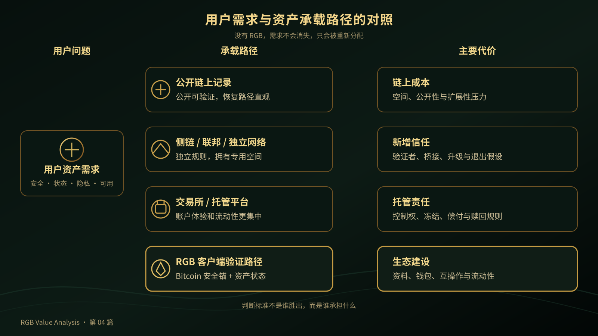

# 《RGB Value Analysis》第 04 篇｜如果没有 RGB，Bitcoin 资产会缺少什么？

> **副标题**：把 RGB 放回问题空间，而不是把它写成唯一答案
> 
> **第 4/20 篇**  
> **状态标签**：协议事实｜产品资料｜推断｜待验证  
> **标签说明**：协议事实来自规范；产品资料来自官方文档；推断是基于事实的判断；待验证表示尚未形成充分产品或市场证据。  
> **最后核验**：2026-08-05  
> **本篇问题**：如果没有 RGB，Bitcoin 资产会缺少什么？

*主视觉说明：Bitcoin 提供安全锚，资产可以通过不同路径承载；RGB 是其中一种选择，而不是唯一答案。*

## 开场：Bitcoin 上的资产需求已经出现，但谁来承担？

假设你长期持有 BTC，也希望在 Bitcoin 生态里使用稳定资产、数字凭证，或者某种可以转移的数字权利。你可能不想为了使用它们再迁移到一套完全独立的安全网络，也不想把所有资产都交给交易所或托管平台。

这时问题就出现了：**如果没有 RGB，Bitcoin 资产仍然可以存在，但它缺少的能力，会由谁来补上？**

这篇文章不是要证明“没有 RGB 就没有 Bitcoin 资产”，也不是要宣布 RGB 是所有方案的终点。我们只做一件事：把资产需求放回原来的问题空间，看看安全、状态、隐私、钱包和流动性分别需要什么样的承载方式。

## 先说结论

没有 RGB，并不意味着 Bitcoin 不能拥有任何资产。资产仍然可以通过更公开的链上记录、侧链或联邦、托管平台，或者其他资产协议来实现。

但这些方式会把责任分配给不同的地方：有的消耗更多 Bitcoin 链上空间，有的引入新的验证者或桥接信任，有的把控制权交给平台，有的则需要重新建立一套钱包、索引器和交易服务。

RGB 想提供的是另一条路径：让 Bitcoin 继续承担安全锚和最终结算，让资产状态由相关参与者进行客户端验证，把不必全网复制的详细资料留在链下，同时把资产权利与 Bitcoin 交易图中的可花费输出关联起来。

它的价值不是“替代所有方案”，而是提供一种新的权衡：更少的全网状态复制和更强的隐私潜力，换来资料保存、钱包恢复、互操作和流动性建设的额外责任。

## 一、Bitcoin 原生资产必须回答四个问题

讨论一种资产是否适合 Bitcoin，不能只问“能不能发行”，还要问四件事：

1. **安全与结算由谁负责？** 交易历史由谁维护，争议时由谁确认有效转移？如果用户不想依赖新的验证者、联邦或平台，Bitcoin 的共识与结算就很重要。
2. **状态由谁保存和验证？** 发行、转移、销毁和供应量规则，是由所有节点保存，还是由收款方和相关参与者验证？这不是“验证”和“不验证”的区别，而是责任如何分配。
3. **隐私与扩展性如何平衡？** 每次转移都必须公开写入基础层吗？全网复制带来可见性、空间和成本，减少公开数据则会提高资料传递与恢复的重要性。
4. **用户能否真正使用？** 钱包能否显示、备份和恢复资产？用户能否收款、支付、兑换和退出？只有“被发行出来”的资产，距离可用还很远。

RGB 不是凭空创造这些问题，而是尝试把它们放进一条 Bitcoin 原生路径。

*问题图说明：安全、状态、隐私与可用性，是任何 Bitcoin 原生资产都必须回答的四个问题。*

## 二、没有 RGB 时，需求通常由哪些方式承担？

没有 RGB，需求不会消失，只会被重新分配给其他方案。

### 路径一：把更多资产数据直接写入 Bitcoin 链上

优点是记录公开、位置明确，任何人都可以按同一份历史检查状态；代价是占用链上空间、暴露更多活动，并可能带来扩展性和费用压力。它解决“大家看同一份数据”，却不自动解决资产规则、钱包体验和流动性。

### 路径二：依赖侧链、联邦或其他独立结算网络

独立网络可以拥有自己的资产规则、吞吐量和应用空间，但用户也要接受新的验证者、升级机制、桥接和退出假设。获得新能力的同时，也新增了一套需要维护和信任的网络。

### 路径三：依赖交易所、发行方或托管平台

托管平台的账户体验、客服和流动性可能更集中，但用户不再直接控制资产。冻结、平台安全、发行方偿付和赎回规则，都会成为可用性的前提。

### 路径四：使用其他 Bitcoin 资产协议

其他协议可以针对特定需求设计状态和交互，可能在某些场景更简单；但协议之间未必兼容，钱包、索引器、支付和交易产品往往需要重复适配。

所以，问题从来不是“有没有方案”，而是：**每一种方案把信任、数据和产品复杂度放在了哪里？**

*流程图说明：没有 RGB，资产需求仍会被承载，只是信任、数据和体验代价会被分配给不同路径。*

## 三、RGB 想补上的，究竟是哪一块？

### 1. 技术价值：把状态、隐私与 Bitcoin 交易图连接起来

RGB 把资产权利与 Bitcoin 交易图中的特定输出关联。Bitcoin 负责交易锚定、花费条件和最终结算；RGB 的客户端资料负责说明资产从发行到当前状态经历了什么，以及转移是否符合合约规则。Bitcoin 不必理解每种资产的业务逻辑，也不必把所有状态变成公开账户表。

RGB 使用一次性封印把状态变化接回 Bitcoin：旧输出被花费时，旧封印关闭；新的输出承载下一步分配。详细资料由相关参与者验证，而不是要求全网保存每份业务状态。这有隐私和扩展性潜力，也把资料传递、备份和恢复责任交给钱包与用户。

### 2. 生态价值：形成共同的资产协作接口

发行方、钱包、传输服务、Lightning、交易产品和商户，可以围绕共同的资产状态和转移规则协作，减少每个应用从零设计的成本。“发行—持有—支付—兑换”因此有机会成为一条连续路径。

但协议标准不等于产品已经互操作。收款、资料恢复、索引和资产显示，都需要逐项测试。

### 3. 流动性价值：让资产有机会进入支付与交易

资产被发行出来，只说明它有了初始状态；能否支付、兑换和收款，还取决于钱包、通道、报价、做市、LSP、DEX 和赎回服务。RGB 可以与 Bitcoin/Lightning 生态寻找高频流转路径，但“可以协作”不等于“已经拥有流动性”。

### 4. 应用价值：从“可发行”走向“可使用”

稳定计价支付、跨境收款、数字凭证、RWA、AI Agent 和游戏资产，都需要用户清楚地知道自己拥有什么，并把它安全交给下一个人。资产规则、状态验证、钱包体验和流动性必须依次成立，真实应用才不会停留在演示层。

## 四、RGB 的价值捕获在哪里？

这一节需要特别谨慎。RGB 协议本身不等于自动产生手续费、收入或代币价值，也不能替发行方保证资产储备和赎回。

RGB 可能创造的经济空间，首先来自一条更清晰的 Bitcoin 原生资产路径：发行方可以发行资产，钱包可以管理资产，状态传输服务可以交付验证资料，LSP 可以提供流动性，支付和交易产品可以收取服务费用，发行方或兑换服务可以承担赎回环节。

但这些价值属于不同层次：协议层提供规则和验证框架；基础设施层提供钱包、传输、索引、LSP 和支付服务；应用层提供交易、商户、RWA 或其他具体使用场景。不能因为某个产品可以收费，就把它的商业模式写成 RGB 的协议收益。

最终能否形成价值捕获，取决于资产发行规模、用户留存、钱包可用性、流动性深度、互操作和责任边界是否真实成立。**协议提供可能性，生态采用才会把可能性转化为价值。**

## 五、RGB 补上一种选择，但还没有替生态解决一切

RGB 可能补上的，是一种把资产状态、Bitcoin 结算和客户端验证连接起来的路径；它也可能带来更清晰的资产协作接口。但这并不意味着其他方案失去价值，更不意味着 RGB 已经解决了所有产品问题。

用户和生态仍要面对四项责任：

1. **资料责任**：验证资料需要可靠传递、保存、备份和恢复，不能只保留一个地址或种子词。
2. **产品责任**：钱包要隐藏 UTXO 和状态复杂度，同时解释支付、恢复与失败原因；不同服务还要真实验证互操作性。
3. **流动性责任**：有资产不等于有买家、报价、通道或商户，LSP、DEX、做市和赎回服务仍需建设。
4. **发行责任**：RGB 可以表达资产规则，却不能替发行方保证储备、合规、冻结和兑付；复杂共享状态和高频应用也要逐项判断是否适合。

所以，**没有 RGB，不等于 Bitcoin 完全没有资产，也不等于其他方案在所有维度都更差。** 某些场景可能更适合公开链上记录、托管平台或独立网络。RGB 的意义，是补上一种选择，而不是取消其他选择。

*边界图说明：Bitcoin、RGB、发行方和应用层各自承担不同责任，任何一层都不能替代其他层。*

## 结尾：RGB 补上的，是 Bitcoin 资产设计空间中的一种选择

Bitcoin 可以继续承担安全锚和最终结算，RGB 可以尝试承担资产状态与客户端验证，Lightning、钱包、LSP、DEX、发行方和商户则共同决定资产能否真正流通。

未来的判断标准，不是“有没有 RGB”，也不是“哪条链的叙事更大”，而是某个具体场景在安全、隐私、可用性、流动性和责任边界上是否适合 RGB。

> **没有 RGB，Bitcoin 仍然可以承载资产；但资产状态、隐私、验证和流通需求，就必须由其他方案分别承担。RGB 的价值，是把这些问题重新放回 Bitcoin 原生的设计空间。**

## 下一篇预告

**第 05 篇｜RGB 为什么把验证交给用户？**  
下一篇会解释客户端验证：为什么 RGB 不要求全网保存每一份资产状态，而是让接收方和相关参与者验证与自己有关的历史。

## 给读者的问题

如果你在 Bitcoin 生态中使用一种资产，安全、隐私、钱包体验和流动性里，你最不能妥协哪一项？

## 参考资料

- [RGB Protocol Documentation](https://docs.rgb.info/)
- [RGB Blueprint](https://rgb-org.github.io/)
- [RGB Docs：Client-side Validation](https://docs.rgb.info/distributed-computing-concepts/client-side-validation)
- [RGB Docs：Bitcoin Single-use Seals](https://docs.rgb.info/annexes/single-use-seals-bitcoin)
- [RGB Docs：Commitment Schemes within Bitcoin and RGB](https://docs.rgb.info/commitment-layer/commitment-schemes)
- [Bitcoin Developer Guide：Transactions](https://developer.bitcoin.org/devguide/transactions.html)
- [Bitcoin 白皮书](https://bitcoin.org/bitcoin.pdf)
