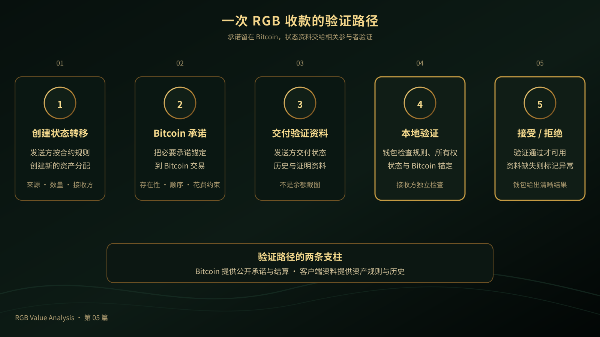

# 《RGB Value Analysis》第 05 篇｜RGB 为什么把验证交给用户？

> **副标题**：客户端验证不是不验证，而是换了验证责任
> 
> **第 5/20 篇**  
> **状态标签**：协议事实｜产品资料｜推断｜待验证  
> **标签说明**：协议事实来自规范；产品资料来自官方文档；推断是基于事实的判断；待验证表示尚未形成充分产品或市场证据。  
> **最后核验**：2026-08-05  
> **本篇问题**：RGB 为什么不让所有节点验证全部资产状态？

*主视觉说明：发送方交付带有封印的状态资料，接收方在 Bitcoin 安全锚下本地验证。*

## 开场：为什么钱包不能只看 Bitcoin 链上的一行记录？

假设你收到一笔 RGB 稳定资产。钱包告诉你“收到了”，但你打开 Bitcoin 区块浏览器，却找不到一行像银行账户那样的公开余额。你可能会问：既然 Bitcoin 的交易是公开的，为什么还要有一份资料交给我？

这正是 RGB 最容易被误解的地方。**RGB 把验证交给用户，不是取消验证，而是让真正相关的参与者在本地验证自己收到的资产历史。**

这里的“用户”也不是指普通人要手工阅读密码学证明，而是指持有资产的客户端、钱包和相关参与者。用户看到的应该是钱包给出的清晰结果：可用、待验证、资料缺失，或者不可接受。

## 先说结论

许多公开链上资产采用全网验证：所有节点看到相同的状态，并按共同规则检查交易。RGB 选择客户端验证：发送方把接收方需要的状态历史和证明资料交付给接收方，接收方检查这项资产从发行到当前转移是否遵守规则；Bitcoin 链上则提供承诺、交易顺序和不可重复使用的锚定。

这种设计可能减少无关节点保存和复制全部资产状态的需要，也为隐私和扩展性留下空间。但它不是单方面的升级：全网少保存一部分资料，用户、钱包和传输服务就必须认真处理资料的接收、备份和恢复。

## 一、全网验证和客户端验证有什么不同？

全网验证的直觉很简单：大家看同一份公开账本。每个节点接收交易，按照共同规则检查它是否有效，并保存足够的数据来继续验证未来的交易。它的优点是状态位置统一、查询直观；代价是所有节点都要处理与自己无关的资产数据。

客户端验证则把范围缩小。与某项资产有关的参与者，验证自己收到的状态历史；详细资料不必全部写入 Bitcoin，也不必由所有节点复制。Bitcoin 仍然负责交易历史、花费条件、承诺发布和最终结算，RGB 客户端负责资产规则和状态转移。

因此，客户端验证不是“验证变少了”，而是“验证者变得更相关了”。钱包软件、发行方、传输服务和接收方共同完成资料交付与验证。普通用户不需要面对全部过程，但钱包必须把结果解释清楚。

*对照图说明：左侧是所有节点共同保存同一份状态，右侧是相关参与者各自验证与自己有关的资料。*

## 二、一次 RGB 收款到底验证了什么？

可以把一次收款拆成四步。

### 第一步：发送方创建状态转移

发送方根据 RGB 合约规则，创建新的资产分配。转移资料要说明资产来自哪一段历史、转给谁、数量是多少，以及新状态如何承接旧状态。

### 第二步：状态转移与 Bitcoin 建立承诺关系

RGB 把必要的承诺锚定到 Bitcoin 交易。Bitcoin 不需要理解这项资产的全部业务规则，但可以提供公开的交易存在性、时间顺序和花费约束，让状态转移不是一份可以随意改写的私人记录。

### 第三步：发送方交付验证资料

接收方需要拿到足够的状态历史和证明资料，才能从发行或上游状态一路检查到当前收款。这些资料不是余额截图，而是让客户端重建并验证状态历史的资料包，通常会被称为 Consignment 等转移资料。

### 第四步：接收方本地验证并接受或拒绝

钱包检查合约规则、状态转移、所有权条件和 Bitcoin 锚定是否一致。验证通过，资产才进入可用状态；如果资料不完整、规则不符或锚定无效，钱包应拒绝收款，或明确标记为不可用。

这四步说明了一件事：Bitcoin 链上看到的是承诺和交易，接收方验证的是资产从过去到现在是否有效。两者缺一不可。

*流程图说明：状态转移、Bitcoin 承诺、资料交付和本地验证共同决定一次收款是否可用。*

## 三、RGB 把验证交给用户，创造了什么价值？

### 技术价值

无关节点不必保存每项资产的完整业务资料，详细资产历史可以只在相关参与者之间传递和验证。Bitcoin 作为承诺与结算层，RGB 作为资产状态与规则层，二者分工更清晰。

代价也必须同时写出：资料必须可获得、可验证、可备份。用户不能只保存一个余额数字，然后期待钱包在任何设备上自动重建全部历史。

### 生态价值

接收方可以独立检查自己收到的资产，而不是完全依赖某个平台的余额接口。发行方、钱包、传输服务和应用，也可以围绕同一套状态资料协作。

这让责任更容易分层：RGB 规则负责资产状态，Bitcoin 负责交易锚定，钱包负责把验证结果交给用户。协议标准可以减少重复设计，但不代表所有产品已经自动互操作。

### 流动性价值

一笔资产转移不只是发送数量和收款地址，还要交付验证所需资料。钱包、传输服务以及 Lightning/LSP，需要把这一步做成用户无感的流程。

如果资料无法及时交付，资产即使在协议层存在，也可能无法被下一位用户安全接收。对 RGB 来说，资料流动本身就是资产流动的一部分。

### 应用价值

稳定币、数字凭证、RWA 和游戏资产，都需要用户知道自己拥有什么、它从哪里来、当前是否仍然有效。客户端验证让用户不必只相信一个账户余额接口，而是由钱包验证自己收到的权利历史。

未来好应用的标准，不是让用户看到更多密码学细节，而是让验证结果可靠、可解释、可恢复。

## 四、客户端验证的责任边界

用户和钱包需要保存密钥以及与资产有关的状态资料，并确保收款资料可以被正确接收和恢复。钱包还要区分“可用”“待验证”“资料缺失”和“不可支付”，不能把所有状态都显示成一个简单余额。

发行方负责合约规则、初始状态和发行承诺；传输服务负责把接收方需要的资料交付出去，但不能替用户承担最终验证责任。

Bitcoin 提供交易历史、花费条件、承诺发布和最终结算；RGB 规则与客户端资料负责资产状态、所有权转移和合约一致性。协议不能替钱包保证备份，也不能替发行方保证储备和兑付。

*边界图说明：Bitcoin、RGB、发行方、钱包和传输服务各自承担不同责任，任何一层都不能替代其他层。*

## 五、普通用户最容易误解的四件事

第一，**客户端验证不是不验证。** 只是验证者从“所有节点”变成“相关参与者”。

第二，**交给用户不是让用户手算。** 钱包应自动完成验证，高级用户才需要查看详细资料。

第三，**链上有承诺不等于链上有完整资产状态。** Bitcoin 可以证明某项承诺被发布，资产规则和历史仍需要客户端资料。

第四，**种子词不一定等于完整恢复。** 如果 RGB 状态资料没有备份，重新安装钱包可能无法独立重建资产历史。

## 结尾：验证责任改变，资产网络的边界也改变

客户端验证让 RGB 有机会减少全网数据复制，同时保留 Bitcoin 的安全锚定。但它也要求钱包、传输服务和用户认真处理资料可用性。

未来的好钱包，应当把“验证责任在用户”转化为“用户拥有可验证的控制权”，而不是把复杂性直接推给用户。

> **RGB 把验证交给用户，不是把安全责任甩给用户，而是让真正拥有资产的人，能够在本地验证自己收到的权利。**

## 下一篇预告

**第 06 篇｜一次性封印到底封住了什么？**  
下一篇会用“只能使用一次的权利封条”解释 RGB 如何把资产状态变化与 Bitcoin 输出关联起来，并说明它解决的是唯一性，而不是替资产背书。

## 给读者的问题

如果钱包能自动验证资产历史，你还希望它向你展示哪些验证结果？

## 参考资料

- [RGB Docs：Client-side Validation](https://docs.rgb.info/distributed-computing-concepts/client-side-validation)
- [RGB Docs：Single-use Seals and Proof of Publication](https://docs.rgb.info/distributed-computing-concepts/single-use-seals)
- [RGB Docs：Components of a Contract Operation](https://docs.rgb.info/rgb-state-and-operations/components-of-a-contract-operation)
- [RGB Docs：Commitment Schemes within Bitcoin and RGB](https://docs.rgb.info/commitment-layer/commitment-schemes)
- [RGB Blueprint](https://rgb-org.github.io/)
- [Bitcoin Developer Guide：Transactions](https://developer.bitcoin.org/devguide/transactions.html)
