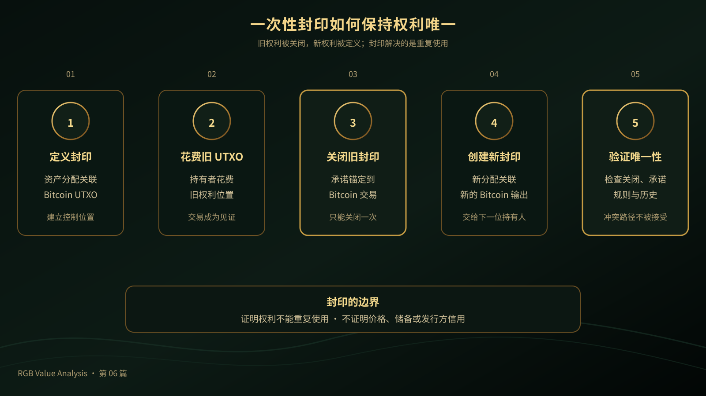

# 《RGB Value Analysis》第 06 篇｜一次性封印到底封住了什么？

> **副标题**：用一张只能使用一次的权利封条理解 RGB 的唯一性
> 
> **第 6/20 篇**  
> **状态标签**：协议事实｜产品资料｜推断｜待验证  
> **标签说明**：协议事实来自规范；产品资料来自官方文档；推断是基于事实的判断；待验证表示尚未形成充分产品或市场证据。  
> **最后核验**：2026-08-05  
> **本篇问题**：为什么一份可复制的数字文件，不能证明权利只被使用一次？

*主视觉说明：一项带有唯一封印的数字权利，以 Bitcoin 交易作为公开安全锚。*

## 开场：一张数字权利凭证，为什么不能被花两次？

假设你收到一份 RGB 资产资料，里面证明你拥有某项资产。发送方把同一份资料复制后再交给另一个人，另一个人也声称自己拥有这项资产。两个人手里的文件看起来都一样，谁才是真的持有人？

这就是 RGB 必须解决的问题：**如果资产状态主要由客户端保存和验证，而不是放在一个所有人都能查询的公开账户表里，接收方靠什么判断自己收到的权利没有被重复使用？**

可以把一次性封印理解成附在可花费票据上的防伪封条。封条只能被关闭一次，关闭后就不能沿着另一条有效路径再次使用。但它解决的是权利转移的唯一性，不是资产价格、发行方信用或现实世界储备。

## 先说结论

一次性封印封住的不是金额，而是某项状态转移的唯一性。RGB 把资产分配关联到 Bitcoin 交易输出，也就是一个可以被特定条件花费的 UTXO。当持有者花费这个输出时，旧封印被关闭；新的输出可以承载新的资产分配和新的封印定义。

于是，接收方可以沿着“旧封印关闭—新封印创建”的关系检查一项权利是否被重复使用。Bitcoin 提供公开的花费事实和交易顺序，RGB 客户端资料提供资产规则和状态历史，两者共同构成可验证的所有权迁移。

## 一、普通封条与数字一次性封印有什么不同？

普通封条附在容器或票据上，打开后就能看出它已经被使用。它不能证明容器里的东西有价值，只能证明某次交付是否发生过变化。

数字资料却可以被无限复制。单靠一份文件，无法证明它只被使用一次；你需要一个难以伪造的发布介质，让所有相关参与者都能确认某个事件确实发生过。Bitcoin 的交易和区块历史，可以承担这个公开见证的角色。

所以，一次性封印的核心任务有三点：

1. 把一项数字权利放到一个可以被控制和花费的位置上。
2. 让这个位置只能被关闭一次。
3. 让关闭事件与下一项权利的创建建立可验证联系。

它不替发行方证明资产有储备，也不替钱包保存完整资料，更不替用户判断资产是否值得购买。

*问题图说明：普通数字文件可以被复制，而一次性封印把权利迁移绑定到一次可验证的关闭事件。*

## 二、一次性封印如何在 Bitcoin 上工作？

### 第一步：封印定义

RGB 将资产分配关联到一个 Bitcoin 交易输出，也就是一个 UTXO。这个输出由特定的脚本或密钥条件控制，代表新的持有人拥有一个可以使用的权利位置。

封印定义不是资产的全部资料。它更像一个指针：告诉参与者，某项客户端状态与哪个 Bitcoin 控制位置相关。资产的规则、来源和历史，仍然需要通过 RGB 状态资料来验证。

### 第二步：封印关闭

当持有者花费这个 UTXO，相关 Bitcoin 交易就成为关闭旧封印的事件。RGB 可以把状态转移的承诺锚定到这笔交易，使旧权利的关闭和新的状态变化建立联系。

由于 Bitcoin 的 UTXO 不能被同一条链上的两笔有效交易同时花费，旧封印也不能被两条有效路径同时关闭。这里的唯一性来自 Bitcoin 的花费事实与 RGB 的状态规则共同作用，而不是来自一张可以独立复制的数字图片。

### 第三步：创建新封印

状态转移可以为新的接收方创建新的资产分配，并关联到新的 Bitcoin 输出。于是形成一条连续关系：旧封印被关闭，新封印被定义；下一次转移再重复这个过程。

这也是为什么 RGB 的资产转移不是修改一个账户余额。它更像是交出旧的权利票据，再生成一张属于下一位持有者的新票据。

### 第四步：验证唯一性

接收方需要检查旧封印是否真的被关闭、交易承诺是否正确、状态规则是否一致。如果同一个旧输出已经被花费，另一条冲突路径就不能同时被接受。

但接收方仍然需要完整的客户端资料，才能判断发行规则、资产数量、所有权条件和历史是否正确。封印只解决“能否重复使用”，不替代整套资产验证。

*流程图说明：从定义封印到验证唯一性，旧权利关闭后才能创建新的权利位置。*

## 三、一次性封印为 RGB 创造了什么价值？

### 技术价值

资产状态不必全部写入 Bitcoin，但权利迁移有一个公开可检查的锚。UTXO 的一次性花费特性，为客户端状态提供唯一性约束；Bitcoin 负责发布和排序，RGB 负责规则、分配和历史验证。

### 生态价值

发行方、钱包、传输服务和收款方，都可以围绕“旧权利关闭、新权利创建”的共同语义协作。钱包可以据此判断资产是否可支付、是否需要找零，以及是否存在冲突状态。

### 流动性价值

有了唯一性约束，资产才有机会在钱包、支付服务、DEX 或 Lightning 场景中继续流转。但封印本身不会创造买家、通道、报价或赎回服务；资料交付和流动性仍要由生态建设完成。

### 应用价值

稳定币、数字凭证、票据和游戏资产，都需要知道一项权利是否已经交付、是否仍然有效。一次性封印把“我拥有一项权利”转化成可以沿 Bitcoin 交易路径检查的状态迁移。

## 四、封印、承诺、Witness 与状态资料分别负责什么？

这四个概念不能混为一谈：

1. **封印**：定义一项只能被关闭一次的权利位置。
2. **关闭事件**：通常由花费相关 Bitcoin 输出的交易触发。
3. **Witness 与承诺**：证明某笔交易确实承载了对应的状态承诺，并把客户端资料与 Bitcoin 事件连接起来。
4. **状态资料**：让接收方检查资产规则、历史、分配和所有权条件。

换句话说，封印不等于承诺，承诺不等于完整资产资料，资料也不等于发行方信用。它们是同一条验证路径上的不同部件。

*边界图说明：Bitcoin、RGB 状态资料、发行方信用和钱包资料各自承担不同责任。*

## 五、普通用户最容易误解的四件事

第一，**封印不是价格保证。** 它证明权利迁移的唯一性，不证明资产有稳定市场价格。

第二，**封印不是储备证明。** 发行方是否有足够储备，需要另外核验。

第三，**封印不是备份。** 丢失客户端状态资料，仍可能影响资产恢复和验证。

第四，**封印不是“永远不能转移”。** 它只能被关闭一次，关闭后可以定义新的封印和新的权利持有人。

## 结尾：封住的是重复使用，不是所有风险

一次性封印让 RGB 的资产权利可以沿着 Bitcoin 交易图形成连续、唯一的迁移路径。它补上了客户端验证体系中的唯一性约束，却不替代钱包备份、资料交付、发行方责任和流动性建设。

下一步理解 RGB，需要继续区分：什么由 Bitcoin 证明，什么由 RGB 规则验证，什么仍然属于应用和现实世界责任。

> **一次性封印封住的，是一份数字权利不能被同一条规则重复使用；它没有封住价格、信用和所有应用风险。**

## 下一篇预告

**第 07 篇｜RGB 为什么不用账户模型？**  
下一篇会解释 RGB 为什么沿用 Bitcoin 的 UTXO 逻辑，而不是建立一个全局账户余额，并说明这种选择给钱包和用户带来了什么代价。

## 给读者的问题

如果一项资产的权利只能沿着一条有效路径转移，你最希望钱包向你解释哪一步？

## 参考资料

- [RGB Docs：Bitcoin Single-use Seals](https://docs.rgb.info/annexes/single-use-seals-bitcoin)
- [RGB Docs：Single-use Seals and Proof of Publication](https://docs.rgb.info/distributed-computing-concepts/single-use-seals)
- [RGB Docs：Commitment Schemes within Bitcoin and RGB](https://docs.rgb.info/commitment-layer/commitment-schemes)
- [RGB Docs：Components of a Contract Operation](https://docs.rgb.info/rgb-state-and-operations/components-of-a-contract-operation)
- [RGB Blueprint](https://rgb-org.github.io/)
- [Bitcoin Developer Guide：Transactions](https://developer.bitcoin.org/devguide/transactions.html)
